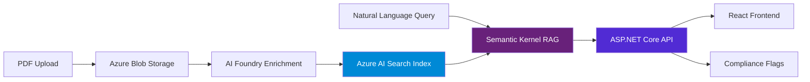

# Trade Intelligence Platform

> RAG-powered document intelligence for regulated trading — MiFID II, EMIR compliance automation at scale.

[](https://dotnet.microsoft.com)
[](https://azure.microsoft.com/en-us/products/ai-services/ai-search)
[](https://azure.microsoft.com/en-us/products/ai-services/openai-service)
[](https://github.com/microsoft/semantic-kernel)
[](https://www.docker.com)

---

## What It Solves

At Commerzbank, MiFID II compliance checks on trade documents were done **manually** — reading PDFs, comparing against regulation clauses, flagging exceptions in spreadsheets.

This platform automates the entire document intelligence layer:

- Ingest any trade document, research report, or regulatory filing (PDF)
- Azure AI Foundry extracts instrument, direction, risk flags, regulation clauses
- Azure AI Search indexes with vector + keyword + semantic ranking
- Ask any question in plain English — get cited answers in seconds
- Automatic MiFID II / EMIR compliance flag detection

---

## Architecture



**Components:**
| Component | Technology | Purpose |
|-----------|-----------|---------|
| API | ASP.NET Core 10 Minimal API | REST endpoints, orchestration |
| RAG Engine | Semantic Kernel 1.x | Retrieval-augmented generation |
| Search | Azure AI Search (Standard) | Hybrid vector + keyword + semantic |
| LLM | Azure OpenAI GPT-4o | Answer generation with citations |
| Embeddings | text-embedding-3-large (1536d) | Document + query vectorisation |
| Ingestion | Azure AI Foundry | PDF extraction, enrichment, chunking |
| Storage | Azure Blob Storage | Original document archive |
| Frontend | React + TypeScript | Query UI, document manager |

---

## Quick Start

```bash
# 1. Clone and configure
git clone https://github.com/milesbusiness/trade-intelligence-platform
cp appsettings.example.json appsettings.json
# Fill in Azure endpoints and API keys

# 2. Run with Docker Compose
docker-compose up

# 3. Open
http://localhost:8080        # API + Swagger UI
http://localhost:3000        # React frontend
```

---

## API Reference

| Method | Endpoint | Description |
|--------|----------|-------------|
| `POST` | `/api/query` | Ask a natural language question |
| `GET` | `/api/query/history` | Last 50 queries |
| `POST` | `/api/documents/ingest` | Upload and ingest a PDF |
| `GET` | `/api/documents` | List all ingested documents |
| `DELETE` | `/api/documents/{id}` | Remove a document |
| `POST` | `/api/compliance/check` | Check document against MiFID II / EMIR |
| `GET` | `/health` | Health check |

**Example query:**
```json
POST /api/query
{
  "question": "What are the best execution requirements for equity trades under MiFID II?",
  "filters": { "regulation": "MiFID II", "dateFrom": "2024-01-01" }
}
```
```json
{
  "answer": "Under MiFID II Article 27, investment firms must take all sufficient steps to obtain the best possible result for clients when executing orders...",
  "citations": [
    { "documentName": "mifid2-rts-27.pdf", "pageNumber": 14, "excerpt": "...best execution policy must consider price, costs, speed, likelihood of execution..." }
  ],
  "complianceFlags": [],
  "processingTimeMs": 847
}
```

---

## Azure Infrastructure

Deployed with Bicep (`infra/main.bicep`) — one command provisions everything:

```bash
az deployment group create \
  --resource-group rg-trade-intelligence \
  --template-file infra/main.bicep \
  --parameters environment=prod
```

Resources provisioned:
- Azure AI Search (Standard S1)
- Azure OpenAI (GPT-4o + text-embedding-3-large deployments)
- Azure AI Foundry workspace
- Azure Storage Account (GRS)
- Azure Container Apps (API)
- Azure Key Vault (all secrets)

---

## Interview Context

*"I implemented MiFID II compliance reporting at Commerzbank manually. Analysts read hundreds of pages of trade documentation against regulation clauses and flagged exceptions in spreadsheets. This platform replaces that entirely — any trade document, any regulatory question, answered in seconds with exact citations. The compliance check runs automatically on every ingested document."*

---

## License

MIT — built on [azure-search-openai-demo](https://github.com/Azure-Samples/azure-search-openai-demo) (MIT)
